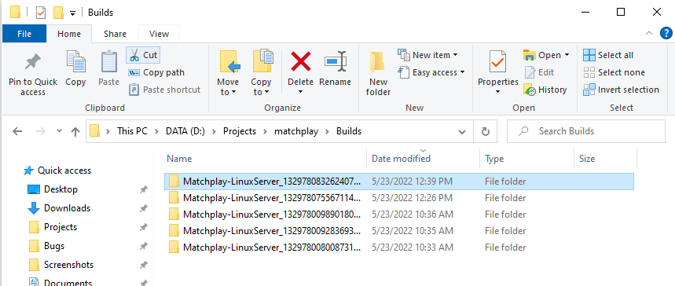
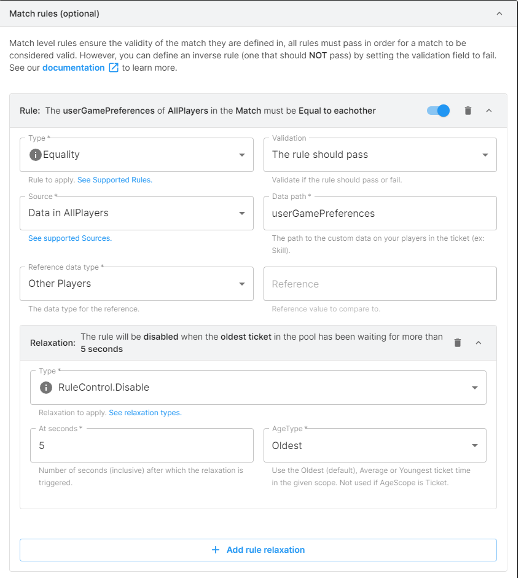

# Matchplay - Matchmaker + Multiplay Sample

_Tested with Unity 2021.2 for PC and OSX clients, and Linux Headless servers._

This sample demonstrates how to create a _Matchmake_ button; a basic networked clientserver game with a matchmaking feature from end to end using the Unity Engine and Cloud Services SDK.

Note This is not a “drag-and-drop” solution; the Matchplay Sample is not a minimal code sample intended to be completely copied into a full-scale project. Rather, it demonstrates how to use multiple services in a vertical slice with some basic game logic and infrastructure. Use it as a reference to learn how Matchmaker and Multiplay work together to make a common end-user feature.

## Features

 Matchmaking Ticket Config Players can set their preferences for the map and game mode they want.
 Matchmaking Players can click the matchmaking button to begin looking for a match.
 Matchmaker Allocation Payload Server gets information about the match and configures the server accordingly.
 Multiplay Server Allocation Spin up a dedicated cloud server and pass its information to the player.
 Basic ClientServer Netcode Experience Lightweight server that can be hosted on Multiplay.

## Project Overview

The Project can run in Client or Server modes, and in localservice modes. 
The server will attempt to find services for 5 seconds, and if it can’t, will start the server with some default settings for local testing. The client can directly connect to this server via the local host ip. 

 
Scenes 

 bootStrap - You must play from this scene for things to work.
 mainMenu - Client UX, shows the matchmaker and local connection buttons.
 game_lab - One of the game scenes, with a table.
 game_space - Another one of the game scenes, features a sphere!

Start as a Client

The Project will run as a client when

1. You play the matchplay project in-editor from bootStrap
2. You run a non-server build on your platform of choice.
3. You play a Parrelsync clone project with “client” in the arguments field.

The client can either connect via Matchmaker or local connection via the UI. 
Matchmaking expects you have followed the [Sample Setup Guide](#Sample-Setup-Guide) below.

Start as Server

The project will run as a server when

1. You run a server build on your platform of choice
2. You run a Parrelsync clone project with “server” in the argument field.
3. Multiplay will run the server automatically when the matchmaker finds a match.

The Server is fire-and-forget. It will either get its configuration from the matchmaker, or start with defaults. (for local Netcode testing)

### Cloud Project and Organization

To use Unity’s multiplayer services, you need a cloud organization ID for your project. Follow the guide below to  set up your org if you don't have one

[https://support.unity.com/hc/en-us/articles/208592876-How-do-I-create-a-new-Organization-](https://support.unity.com/hc/en-us/articles/208592876-How-do-I-create-a-new-Organization-) \
For connecting your project with services, follow this guide

[https://docs.unity3d.com/ManualSettingUpProjectServices.html](https://docs.unity3d.com/ManualSettingUpProjectServices.html)

### Services

#### Authentication

Matchmaker and Multiplay depend on Unity Authentication 2.0 for credentials. This sample uses Unity Auth’s anonymous login feature to create semi-permanent credentials that are unique to each player but do not require developers to maintain a persistent account for them. \
More information about Authentication here \
[https://docs.unity3d.com/Manual/com.unity.services.authentication.html](https://docs.unity3d.com/Manual/com.unity.services.authentication.html)

#### Matchmaker

The Matchmaker service allows players to search for other players with the same preferences as them and put them in a match together. It is the best way to allow your players a Find me a good match button.

The Matchmaker documentation contains code samples and additional information about the service. It includes comprehensive details for using the Matchmaker along with additional code samples, and it might help you better understand the Matchplay \
[http://documentation.cloud.unity3d.com/en/collections/3349749-unity-matchmaker](http://documentation.cloud.unity3d.com/en/collections/3349749-unity-matchmaker)

The Lobby service can be managed in the Unity Dashboard \
[https://dashboard.unity3d.com/matchmaker](https://dashboard.unity3d.com/matchmaker)

#### Multiplay

The Multiplay Service hosts game servers in the cloud to allow for easy connection between players from around the world with the best pingperformance possible.

The Multiplay documentation contains code samples and additional information about the service. It includes comprehensive details for using Multiplay along with additional code samples, and it might help you better understand the Matchplay Sample \

[http://documentation.cloud.unity3d.com/en/collections/3254305-multiplay-self-serve](http://documentation.cloud.unity3d.com/en/collections/3254305-multiplay-self-serve)

The Relay service can be managed in the Unity Dashboard \

[https://dashboard.unity3d.com/multiplay](https://dashboard.unity3d.com/multiplay)

## Sample Setup Guide

### Editor & Cloud Project

If you have not already done so, hook up your Editor project to the Cloud Project as described in the [Cloud Project and Organization](#Cloud-Project-and-Organization) chapter.

### Building the Server

In your Matchplay project, go to the top bar and select BuildTools  Linux Server

It should automatically build out your project as a server build, and output it to \
<_project root_>/Builds/Matchplay-<_platformBuildType_>_<_dateTime_>

Next we will upload the server to Multiplay and configure server hosting.

### Multiplay Server Hosting

In your Unity Dashboard, go to Multiplay  Setup Guide and select Create a build. 
Fill in some Details and move to Upload Files. 
Drag your Linux Headless Build into the Drop Box.

Once Uploaded, continue the Setup Guide to Build Configuration

Choose a configuration name, select your previously uploaded build, and select Matchplay.x86_64as your Game server executable. 
Choose SQP for your Query type, and fill in the following as Custom launch parameters 

_-ip 0.0.0.0 -port $$port$$ -queryPort $$query_port$$ -logFile $$server_log_dir$$matchplaylog.log_

Finally we configure the fleet, choose a fleet name, and select the previously created build configuration. For the scaling settings, select 1 minimum available, and 5 max. 

And you’ve got your Multiplay Fleet ready to go!

### Unity Matchmaking

Now that we have our server fleet, we can set up the Matchmaker, similar to the Multiplay dashboard. 
Select Matchmaker  Setup Guide. 
You can click through Integrate Matchmaker for this guide, as the sample already has it integrated in the project. 

Click on Create Queue, 
Important name the queue casual-queue, and set the max players on a ticket to 10.

The exact string queue name needs to match an input string in the SDK

Next create a Pool, select your previously created Multiplay Fleet and Build Configuration. Set the timeout to 15 seconds.

#### Match definition Rules

Set up the region you are playing from. (Should be same as your Server Fleet Region) 
Set up the basic team definitions, and skip the advanced rules for now.

The Match rules are the filters that we use in the sample to match the players by their preferences. 
Within the pools and queues, every player will have their settings evaluated against every other player. Since the sample is trying to be simple, and does not have a way to easily test large-scale matchmaking. 

Click finish and you’ll have configured the matchmaker! 

Now you should be able to play the Project in-Editor and have the Matchmaking button magically find you a match and connect you to a Multiplay server, and await more players. 
 
You can use Parrelsync or multiple builds to connect several people to the same server via the Matchmake button. 
 

